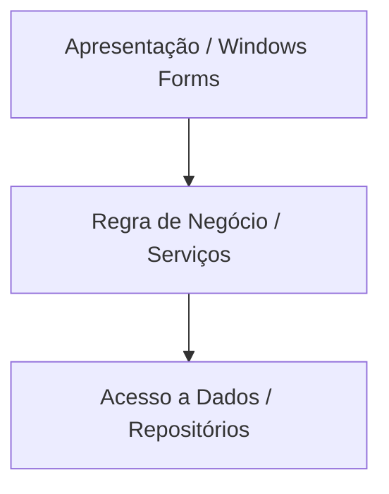

Um dos maiores erros cometidos por quem está começando com Windows Forms é colocar todo o código dentro do próprio arquivo do formulário (`Form1.cs`). Isso cria arquivos com milhares de linhas que misturam design, regras de negócio e consultas de banco de dados. 

O princípio de **Separação de Responsabilidades** dita que cada classe/arquivo deve cuidar de apenas uma parte específica do seu sistema.

---

## A Arquitetura em Camadas Simples

Para organizar projetos escolares e comerciais, uma divisão clássica e eficiente é o padrão de 3 camadas:



### 1. Camada de Apresentação (UI - User Interface)
São os seus `Forms`. 
*   **O que faz:** Desenha os botões, caixas de texto e tabelas; lê o que o usuário digitou; exibe caixas de mensagem (`MessageBox`).
*   **O que NÃO faz:** Não valida regras complexas de negócios (como cálculo de impostos), não se conecta diretamente ao banco de dados MySQL e não executa queries.

### 2. Camada de Negócio (BLL - Business Logic Layer / Services)
Classes puras de C# que contém as regras do sistema.
*   **O que faz:** Valida regras de negócio (ex: *"um produto não pode custar menos que R$ 1,00"*, ou *"apenas maiores de 18 anos podem se cadastrar"*), realiza cálculos matemáticos e decide o fluxo.
*   **O que NÃO faz:** Não exibe telas, não interage com componentes visuais e não tem código SQL.

### 3. Camada de Acesso a Dados (DAL - Data Access Layer / Repositories)
Classes responsáveis por falar diretamente com o MySQL.
*   **O que faz:** Abre conexões com o banco, executa queries SQL (`INSERT`, `SELECT`, `UPDATE`, `DELETE`) e monta as listas de objetos para retornar.
*   **O que NÃO faz:** Não decide se um dado está correto ou não, e não se importa em qual componente visual esses dados serão jogados.

---

## Exemplo Prático: Fluxo de Cadastro de Usuário

Vamos ver como as 3 partes interagem na prática ao cadastrar um novo usuário.

### Passo 1: A Camada de Dados (DAL / Repositório)
Responsável por salvar o usuário no banco.

```csharp
public class UsuarioRepository
{
    public bool InserirNoBanco(string nome, string email)
    {
        using (MySqlConnection conn = Conexao.ObterConexao())
        {
            string sql = "INSERT INTO usuarios (nome, email) VALUES (@nome, @email)";
            using (MySqlCommand cmd = new MySqlCommand(sql, conn))
            {
                cmd.Parameters.AddWithValue("@nome", nome);
                cmd.Parameters.AddWithValue("@email", email);
                
                conn.Open();
                return cmd.ExecuteNonQuery() > 0;
            }
        }
    }
}
```

### Passo 2: A Camada de Negócio (BLL / Validação)
Responsável por validar se os dados seguem as regras de negócio.

```csharp
public class UsuarioService
{
    private UsuarioRepository _repository = new UsuarioRepository();

    public bool CadastrarNovoUsuario(string nome, string email)
    {
        // Regra de Negócio 1: Nome não pode ser muito curto
        if (nome.Length < 3)
            return false;

        // Regra de Negócio 2: E-mail precisa de validação básica
        if (!email.Contains("@") || !email.Contains("."))
            return false;

        // Se passar nas regras, chama o repositório para persistir no banco
        return _repository.InserirNoBanco(nome, email);
    }
}
```

### Passo 3: A Camada de Apresentação (UI / Form)
Apenas coleta o dado, passa para o serviço e dá o feedback visual.

```csharp
private void btnCadastrar_Click(object sender, EventArgs e)
{
    // Coleta os dados digitados na tela
    string nome = txtNome.Text;
    string email = txtEmail.Text;

    // Instancia o serviço de negócios
    UsuarioService service = new UsuarioService();

    // Executa a ação
    bool sucesso = service.CadastrarNovoUsuario(nome, email);

    if (sucesso)
    {
        MessageBox.Show("Usuário cadastrado com sucesso!", "Sucesso", MessageBoxButtons.OK, MessageBoxIcon.Information);
        txtNome.Clear();
        txtEmail.Clear();
    }
    else
    {
        MessageBox.Show("Dados inválidos! Verifique se preencheu o e-mail corretamente e se o nome tem mais de 3 caracteres.", 
                        "Erro de Validação", MessageBoxButtons.OK, MessageBoxIcon.Warning);
    }
}
```
